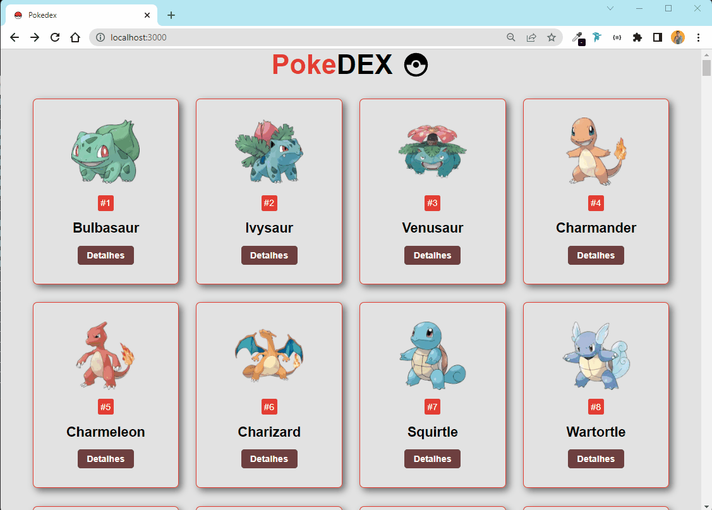

<h1 align="center">

</h1>



<br>

[](https://github.com/Devrieff/Pokedex/blob/main/LICENSE)
<br>

## 📖 **Abount**

The **pokédex** project is a very cool project that brings us a variety of pokémon and has an exclusive page of details for each pokémon.

<br>

## 🔨 **Tool**
- [JavaScript](https://developer.mozilla.org/pt-BR/docs/Web/JavaScript)
- [React](https://pt-br.reactjs.org/docs/getting-started.html)
- [Next JS](https://nextjs.org/docs/getting-started)
- [Sass](https://sass-lang.com/documentation)
- [Api](https://pokeapi.co/)

<br>

## ♻️ **How contribute**

```bash
#Clone the project
$ git clone https://github.com/Devrieff/Pokedex.git
```

```bash
#Enter directory
$ cd Pokedex
```

```bash
#Install the dependencies, if use yarn
$ yarn add
```
<p align="center">Or</p>

```bash
#Install the dependencies, if use npm
$ npm install
```